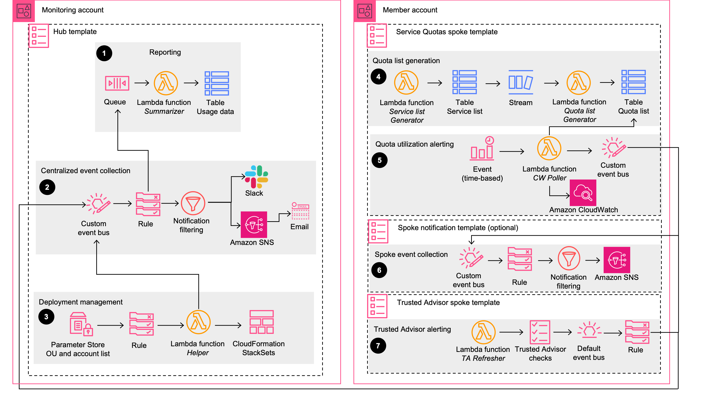
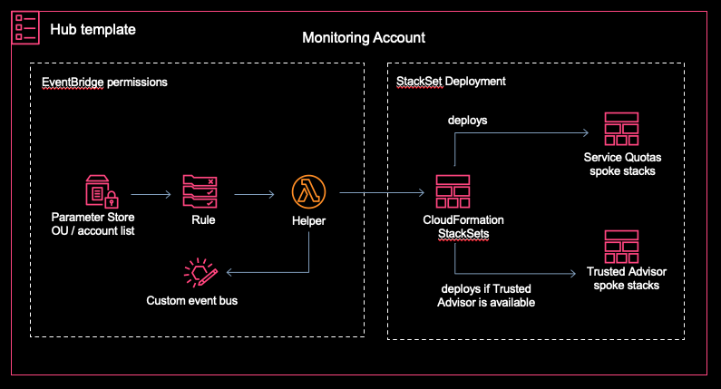

# Quota Monitor for AWS

**[🚀Solution Landing Page](https://aws.amazon.com/solutions/implementations/quota-monitor/)** | **[🚧Feature request](https://github.com/aws-solutions/quota-monitor-for-aws/issues/new?assignees=&labels=feature-request%2C+enhancement&template=feature_request.md&title=)** | **[🐛Bug Report](https://github.com/aws-solutions/quota-monitor-for-aws/issues/new?assignees=&labels=bug%2C+triage&template=bug_report.md&title=)** | **[📜Documentation Improvement](https://github.com/aws-solutions/quota-monitor-for-aws/issues/new?assignees=&labels=document-update&template=documentation_improvements.md&title=)**

_Note: For any relevant information outside the scope of this readme, please refer to the solution landing page and implementation guide._

## Table of content

- [Solution Overview](#solution-overview)
- [Architecture](#architecture)
  - [Deployment Scenarios](#deployment-scenarios)
- [Installation](#installing-pre-packaged-solution-template)
- [Customization](#customization)
  - [Setup](#setup)
  - [Unit Test](#unit-test)
  - [Build](#build)
  - [Deploy](#deploy)
- [Spoke Templates](#independent-spoke-templates)
- [SSM Parameter Store](#ssm-parameter-store-based-workflow)
- [File Structure](#file-structure)
- [License](#license)
- [Operational Metrics](#collection-of-operational-metrics)

## Solution overview

Quota Monitor for AWS is a reference implementation that provides a foundation for monitoring AWS services' quotas usage. Customers can leverage the solution to monitor quotas across services supported by Amazon Trusted Advisor and AWS Service Quotas; in multiple regions and multiple AWS accounts. The solution integrates with Amazon SNS and Slack to notify customers for service quotas approaching thresholds.

## Architecture

The architecture can be broken down into different components, few which are installed in the _monitoring_ account and others are installed in the _monitored_ accounts. The monitoring account also known as hub account, collects all usage events from the monitored accounts (spokes) and raises notifications. Additionally, all the usage events are put on DynamoDB table in the hub account, which can be used to view historical trend of resource usage across all accounts.



#### Deployment scenarios:

The solution follows hub-spoke model and supports different deployment scenarios

- Environments where all AWS accounts are part of your AWS Organization
- Hybrid environments with AWS Organization and independent AWS accounts
- Environments not using AWS Organizations

**hub**: For the first two scenarios use quota-monitor-hub.template. For environments not using Organizations, use quota-monitor-hub-no-ou.template.
_Note: Hub template should be deployed in the monitoring account. For the first two scenarios, this account should also be your delegated administrator for StackSets in the organization._

**spoke**: Spoke templates are automatically deployed by StackSets for targeted Organizational Units. For hybrid environments and environments not using Organizations, deploy the spoke templates individually in the accounts where monitoring is needed.
_Note: ta-spoke.template should be deployed in us-east-1 ONLY. sq-spoke.template can be deployed in any region._

## Installing pre-packaged solution template

- [quota-monitor-hub.template](https://solutions-reference.s3.amazonaws.com/quota-monitor-for-aws/latest/quota-monitor-hub.template)
- [quota-monitor-hub-no-ou.template](https://solutions-reference.s3.amazonaws.com/quota-monitor-for-aws/latest/quota-monitor-hub-no-ou.template)
- [quota-monitor-ta-spoke.template](https://solutions-reference.s3.amazonaws.com/quota-monitor-for-aws/latest/quota-monitor-ta-spoke.template)
- [quota-monitor-sq-spoke.template](https://solutions-reference.s3.amazonaws.com/quota-monitor-for-aws/latest/quota-monitor-sq-spoke.template)
- [quota-monitor-prerequisite.template](https://solutions-reference.s3.amazonaws.com/quota-monitor-for-aws/latest/quota-monitor-prerequisite.template)

_Note: hub, hub-no-ou and sq-spoke templates can be deployed in ANY region; prerequisite and ta-spoke template can be deployed in us-east-1 ONLY._

#### Parameters for hub template

- **Deployment Configuration**: Choose _Organizations_ or _Hybrid_ based on your use-case
- **Notification Configuration**: Choose the notifications you want to receive

_Note: Deployment Configuration parameter is not available in hub-no-ou template._

#### Parameters for spoke templates

- **EventBridge bus arn**: Arn for the EventBridge bus where you want to send usage events

_Note: You may leave rest of the parameters to default._

## Customization

The steps given below can be followed if you are looking to customize the solution or extend the solution with newer capabilities

### Setup

- Javascript Pre-requisite: node=v16.17.0 | npm=8.15.0

Clone the repository and run the following commands to install dependencies, format and lint as per the project standards

```
git clone aws-solutions/quota-monitor-for-aws
cd ./quota-monitor-for-aws
npm ci
npm run prettier-format
npm run lint
```

_Note: Following steps have been tested under above pre-requisites_

## Running unit tests for customization

Run unit tests to make sure added customization passes the tests.

```
cd ./deployment
chmod +x ./run-unit-tests.sh
./run-unit-tests.sh
```

_✅ Ensure all unit tests pass. Review the generated coverage report._

### Build

To build your customized distributable run build from the project root

```
npm run build:all
```

_✅ All assets are now built._

### Deploy

Run the following command from the root of the project

```
cd ./source/resources
npm ci
```

Bootstrap your CDK environment

```
npm run cdk -- bootstrap --profile <PROFILE_NAME>
```

```
npm run cdk -- deploy <STACK_NAME> --profile <PROFILE_NAME>
```

_Note:_

- STACK_NAME, substitute the name of the stack that you want to deploy, check cdk [app](./source/resources/bin/app.ts)
- PROFILE_NAME, substitute the name of an AWS CLI profile that contains appropriate credentials for deploying in your preferred region

_✅ Solution stack is deployed with your customized code._

## Independent spoke templates

There are two spoke templates packaged with the solution

- ta-spoke: provisions resources to support Trusted Advisor quota checks
- sq-spoke: provisions resources to support Service Quotas checks

Both spoke templates are independent standalone stacks that can be individually deployed. You can deploy the spoke stack and route usage events and notifications to your preferred destinations. Additionally, in sq-spoke stack you can control which services to monitor, by toggling _monitored_ status of the services in the DynamoDB table _ServiceTable_. For deploying sq-spoke stack:

```
npm run cdk -- deploy quota-monitor-sq-spoke --parameters EventBusArn=<BUS_ARN> --profile <PROFILE_NAME>
```

_Note:_ BUS_ARN, substitute the arn of the EventBridge bus where you want to send usage events

## SSM Parameter Store based workflow

The solution provisions _/QuotaMonitor/OUs_ and _/QuotaMonitor/Accounts_ SSM Parameter Store. You can modify the parameters at any point after deployment to update the list of targeted organizational-units and accounts for monitoring.

- /QuotaMonitor/OUs: Once you update the parameter, StackSets takes care of deploying the spoke templates in the targeted OUs



- /QuotaMonitor/Accounts: Once you update the parameter, you need to deploy the spoke templates individually in the targeted accounts

## File Structure

The project consists of several microservices, shared utility lambda layer and CDK resources

```
|-deployment/
  |-run-unit-test.sh              [ run all unit tests ]
  |-templates                     [ solution pre-baked templates ]
|-source/
  |-lambda
    |-services/
      |-cwPoller/                 [ microservice for polling CloudWatch metrics for quotas usage ]
      |-deploymentManager/        [ microservice for managing CloudFormation StackSet deployments ]
      |-helper/                   [ microservice for helper modules ]
      |-preReqManager/            [ microservice for fulfilling pre-requisites in the management account ]
      |-quotaListManager/         [ microservice for managing quota list that supports usage monitoring ]
      |-reporter/                 [ microservice for putting quota usage details on dynamodb ]
      |-slackNotifier/            [ microservice for raising alerts on slack ]
      |-taRefresher/              [ microservice for refreshing trusted advisor checks ]
    |-utilsLayer/                 [ lambda layer with shared modules, like logger, metrics, try/catch wrapper ]
  |-resources                     [ cdk resources to provision infrastructure ]
|-README.md
|-additional_files                [ CHANGELOG, CODE_OF_CONDUCT, LICENSE, NOTICE, sonar-project.properties etc.]
```

## License

See license [here](./LICENSE.txt)

## Collection of operational metrics

This solution collects anonymous operational metrics to help AWS improve the quality and features of the solution. For more information, including how to disable this capability, please see the [implementation guide](https://docs.aws.amazon.com/solutions/latest/serverless-transit-network-orchestrator/operational-metrics.html).

---

Copyright Amazon.com, Inc. or its affiliates. All Rights Reserved.

Licensed under the Apache License Version 2.0 (the "License"). You may not use this file except in compliance with the License. A copy of the License is located at

```
http://www.apache.org/licenses/LICENSE-2.0
```

or in the ["license"](./LICENSE.txt) file accompanying this file. This file is distributed on an "AS IS" BASIS, WITHOUT WARRANTIES OR CONDITIONS OF ANY KIND, express or implied. See the License for the specific language governing permissions and limitations under the License.
